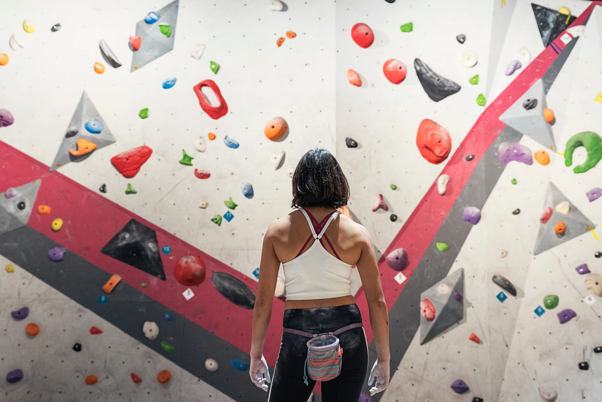
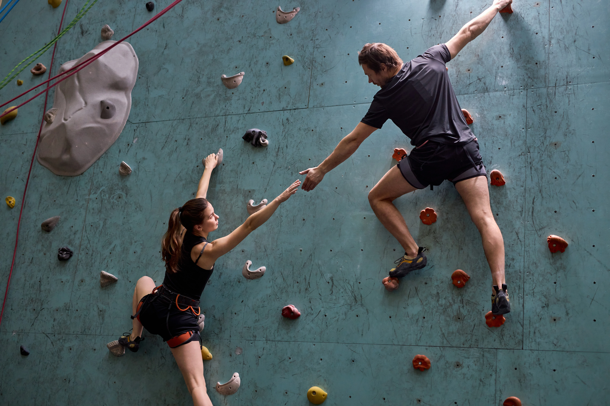
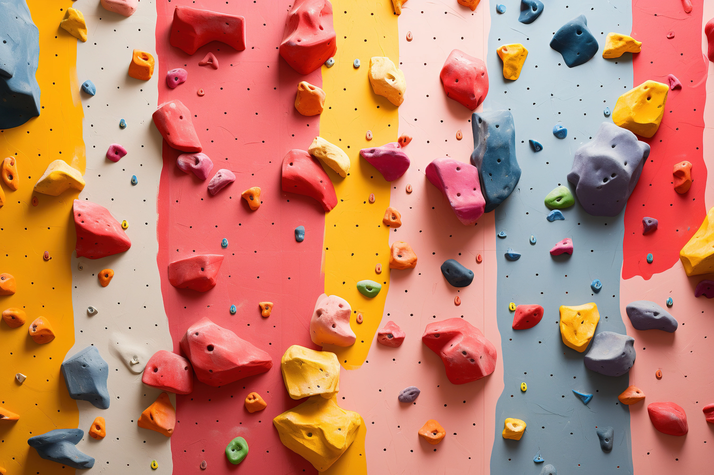
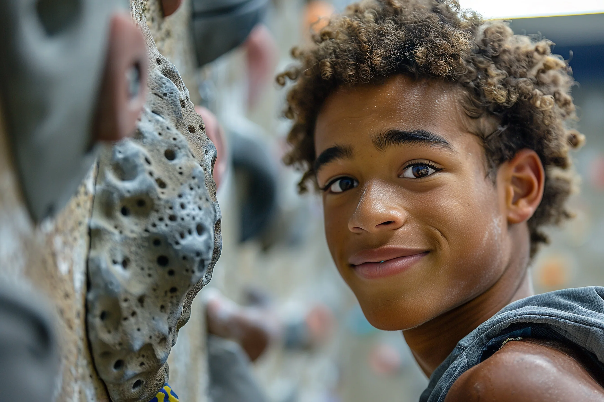
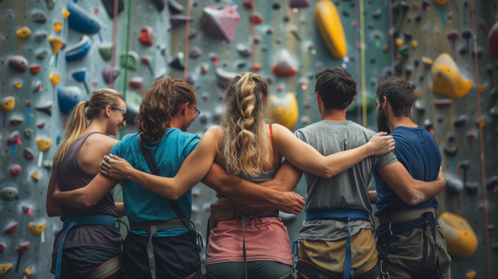
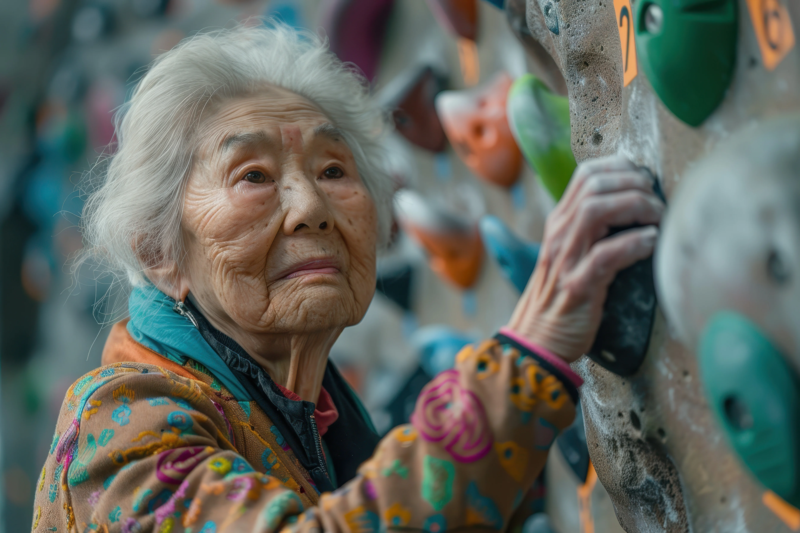

# come-climbing-project-one

visit the deployed site: [Come Climbing](https://zachbh265.github.io/come-climbing-project-one/) 

## Overview

Welcome to the Climbing Club website! This project is designed to provide a place for isolated climbers to do the sport they enjoy, while doing it in a gtroup with other climbers. The website also includes useful resources such as Google Maps links to location, event times, and get started forms.

---

## Table of Contents

## User Experience (UX)

### User Stories

#### First Time Visitor Goals

* I want to find a group of climbers in my area that I can climb with and make freinds. I want to know where, when and how long the sessions will be.
* I want the site to be responsive to my device.
* I want the site to be easy to navigate.

#### Repeat Visitors Goals 

* I want the sessions page to be updatesd regularily so that I can find easliy a session i want to be a part of 

## Design

### Colour Scheme

As climbing gyms are a very colourful environment due to the holds used to set the routes, I didnt want to have a bland set of colours. So while playing with some colours i decided on a shade of blue/green called Persian Green, a darker shade of that colour Sherpa Blue, also a shade of off-white called Alabaster and a highlight colour or Fuzzy Wuzzy Brown (which is a shade of pink) 

* I have used `#fafafa` & `#00aaaa` as the primary and secondary colours used for the sites headers, footers, text and background colours.
* I have used `#005555` as the shadows and index.html text colour.
* I have used `#c65465` as a background colour (i have reduced the opacity of the pink using rbga valuse) also as minor decoration through out the site.

* [Alabaster](https://imagecolorpicker.com/color-code/fafafa)
* [FuzzyWuzzyBrown](https://imagecolorpicker.com/color-code/c65465)
* [PersianGreen](https://imagecolorpicker.com/color-code/00aaaa)
* [SherpaBlue](https://imagecolorpicker.com/color-code/005555)

### Typography

Google Fonts was used to import the chosen fonts for use in the site.

* For the Page Title I have used the google font [Mulish]('https://fonts.googleapis.com/css2?family=Mulish:ital,wght@0,200..1000;1,200..1000&family=Space+Mono:ital,wght@0,400;0,700;1,400;1,700&display=swap'). Mulish is a sans-serif font which features a clean and contemporary design that enhances readability, making it easy for users to consume content on the screen, easpecially when used for all headers in the site.

[Mulish](https://fonts.google.com/specimen/Mulish)

* For the body of the page I have used the google font [Space-Mono]('https://fonts.googleapis.com/css2?family=Mulish:ital,wght@0,200..1000;1,200..1000&family=Space+Mono:ital,wght@0,400;0,700;1,400;1,700&display=swap'). Space Mono is alos a sans-serif font meaning it has high legibility, also a monospaced typeface which also aids readability. I also thought it partnered well with the Mulish font.

[SpaceMono](https://fonts.google.com/specimen/Space+Mono)

### Imagrey 

I wanted acsess to the highest quality pictures available to gove the site a polsihed feel, so I used Adobe's Stock images for this project. I selected the images based on a number of key criteria. 
* one, to make sure there were a wide range of different people, from gender to race and age
* two, that all images had the person or group of people enjoying them selves and were smiling / happy 

 
 
 
 
 
 

### Features 

The website is comprised of a home page, a sessions page and a get started page.

All Pages on the website are responsive and have a favicon in the browser tab. 

#### The Home page

the home page of the come climbing site containsa a title and function navigation bar and footer with social media links. It also contains information about the site, how and where we operate, and who the site is catered for.

#### The sessions page

the sessions page contains the same header and footer elements. Its main function though is to show site users when, where, at what time and how long the sessions we are runnning are. Included in that is a link to google maps showing the location of each climbing gym we use.

#### The Lets get Started Page 

this is where users come to sign up to the sessions we hold. it also contains the smae footer, header and nav bar links as the other pages

#### future implementations

in the future i would like tio bew able to add to the lets get started form an option to select the exact meet you want to come to. 
i would also like to add more dates to the sessions page so that the site doesnt need to be updated a frequently as it does now.

## Technologys Used

### languges
* HTML and CSS

### Frameworks, Libraries & Programs Used

* [Git](https://git-scm.com/) - For version control.

* [Github](https://github.com/) - To save and store the files for the website.

* [GitPod](https://gitpod.io/) - IDE used to create the site.

* [Google Fonts](https://fonts.google.com/) - To import the fonts used on the website.

* [Google Developer Tools](https://developers.google.com/web/tools) - To troubleshoot and test features, solve issues with responsiveness and styling.

* [Cloudinary](https://cloudinary.com/tools/jpg-to-webp) - to convert the adobe stock images from jpeg to webp.

* [AdobeStock](https://stock.adobe.com/uk/) - To find website ready images.

* [Favicon.io](https://favicon.io/) - To create favicon.

* [FontAwsome](https://fontawesome.com/) - To add icons for my social media links 

* [ImageColorPicker](https://imagecolorpicker.com/color-code/2596be) - to aid in picking colors and finding there hex, rgb values.

## Deployment & Local Development

### Deployment

The site is deployed using GitHub Pages - [Come Climbing](https://zachbh265.github.io/come-climbing-project-one/) .

To Deploy the site using GitHub Pages:

1. Login (or signup) to Github.
2. Go to the repository for this project, [ZachBH265/ComeClimbing](https://github.com/ZachBH265/come-climbing-project-1).
3. Click the settings button.
4. Select pages in the left hand navigation menu.
5. From the source dropdown select main branch and press save.
6. The site has now been deployed, please note that this process may take a few minutes before the site goes live.

#### How to Fork

To fork the repository:

1. Log in (or sign up) to Github.
2. Go to the repository for this project, [ZachBH265/ComeClimbing](https://github.com/ZachBH265/come-climbing-project-1).
3. Click the Fork button in the top right corner.

#### How to Clone

To clone the repository:

1. Log in (or sign up) to GitHub.
2. Go to the repository for this project, [ZachBH265/ComeClimbing](https://github.com/ZachBH265/come-climbing-project-1).
3. Click on the code button, select whether you would like to clone with HTTPS, SSH or GitHub CLI and copy the link shown.
4. Open the terminal in your code editor and change the current working directory to the location you want to use for the cloned directory.
5. Type 'git clone' into the terminal and then paste the link you copied in step 3. Press enter.

## Credits

### Code Used

* https://www.w3schools.com/howto/howto_js_navbar_sticky.asp - used to make my nav bar sticky to the top so that when you scroll it always stay on the screen

* I used the code institue tutor support to help with getting the FontAwsome icons to work as the linkn the website gave to me wasnt working (lines 22-25 in all the html pages)

* https://chatgpt.com/ - i used chatgpt to help with the content of my website, It helped making the text more sophisticated and flowing as linguistics is not a primary skill of mine 

### Acknowledgments

I would like to acknowledge the following people:

* Jubril Akolade - My code institute mentor 
* Tutor surport - Code institute tutor surport team 